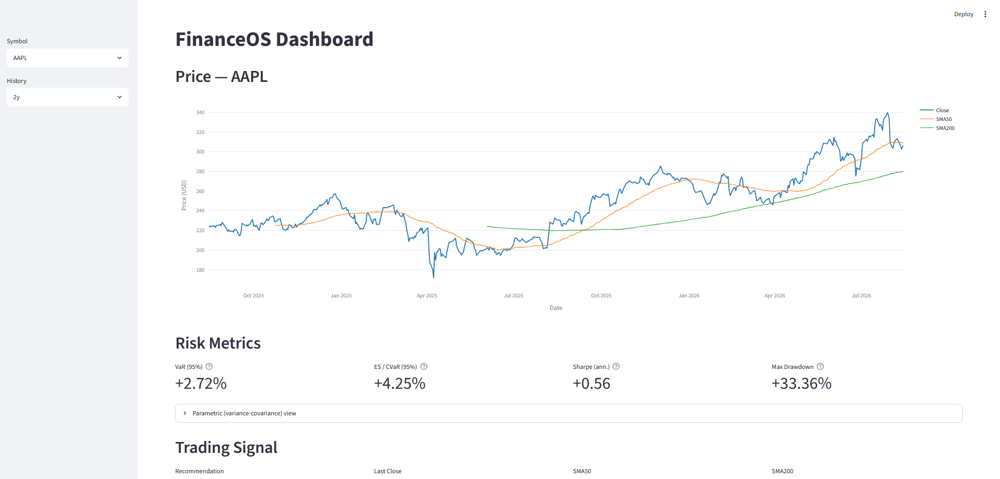
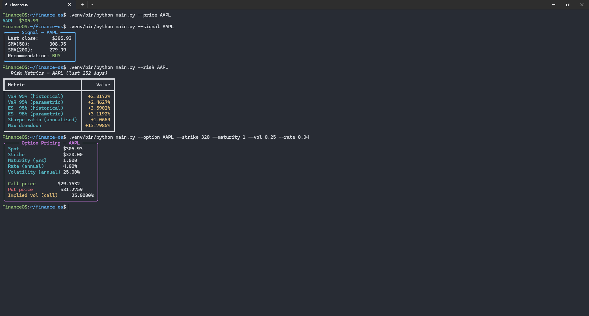

# FinanceOS

### Quantitative Finance & Market Analytics Platform

<p align="center">
  
</p>


A modular quantitative research platform: market data, option pricing, risk analytics, systematic signals, an interactive dashboard, and automated Linux deployment — built as a complete system rather than a set of isolated finance scripts.

**Core capabilities:** market data retrieval & caching · Black-Scholes pricing · implied volatility · historical & parametric VaR/ES · Sharpe ratio · max drawdown · SMA crossover signals · CLI + Streamlit dashboard · systemd automation · mathematical validation suite.

---

## Architecture

```text
                     FinanceOS — Quant Finance Engine
                                   │
        ┌──────────────────────────┼──────────────────────────┐
        ▼                          ▼                          ▼
   Data Layer                 Quant Layer                 UI Layer
   yfinance                   Black-Scholes                CLI
   Caching                    VaR / ES                     Streamlit
   Updater                    Sharpe / Drawdown
                               SMA Signals
        └──────────────────────────┼──────────────────────────┘
                                    ▼
                     Configuration (YAML + env)
```

```text
FinanceOS/
├── config/            settings.yaml, .env.example
├── src/
│   ├── config_loader.py
│   ├── data/           fetcher.py, updater.py
│   ├── models/         pricing.py
│   └── ui/              cli.py, dashboard.py
├── systemd/            dashboard/update services + timer
├── tests/               test_mathematical_suite.py
├── main.py
├── deploy.sh
└── requirements.txt
```

---

## Quantitative Models

**Black-Scholes.** European call/put pricing:

$$C = S_0 N(d_1) - Ke^{-rT}N(d_2), \qquad P = Ke^{-rT}N(-d_2) - S_0N(-d_1)$$

$$d_1 = \frac{\ln(S_0/K) + (r+\sigma^2/2)T}{\sigma\sqrt{T}}, \qquad d_2 = d_1 - \sigma\sqrt{T}$$

Validated against the textbook case (S=K=100, T=1, r=5%, σ=20% → Call ≈ 10.450584, Put ≈ 5.573526) and against put-call parity, $C - P = S_0 - Ke^{-rT}$.

**Implied volatility.** Numerical root-finder recovers σ from an observed price; validated via round-trip (known σ → BS price → solved σ).

**Value-at-Risk.** Historical: $VaR_\alpha = -Q_{1-\alpha}(R)$. Parametric (normal): $VaR_\alpha = -(\mu + z_{1-\alpha}\sigma)$.

**Expected Shortfall.** Historical: $ES_\alpha = -E[R \mid R \leq Q_{1-\alpha}(R)]$. Parametric: $ES_\alpha = -\left(\mu - \sigma\frac{\phi(z_{1-\alpha})}{1-\alpha}\right)$. Tested to confirm ES is consistently more severe than VaR.

**Sharpe ratio (annualized):** $\dfrac{\mu_R N - r_f}{\sigma_R\sqrt{N}}$, default $r_f = 4\%$.

**Maximum drawdown:** $DD_t = \dfrac{P_t}{\max_{u\leq t}P_u} - 1$, $MDD = -\min_t(DD_t)$, reported with peak/trough dates.

**SMA crossover signal** (defaults: 50/200-day windows, 1% neutral band):

```text
Short SMA > Long SMA × 1.01  → BUY
Short SMA < Long SMA × 0.99  → SELL
Otherwise                    → HOLD
```

All models are validated in `tests/test_mathematical_suite.py` against known analytical values, not just execution success.

---

## Command-Line Interface

<p align="center">
  
</p>

---

## Market Data

Provider: `yfinance`. Default watchlist: AAPL, MSFT, GOOGL, TSLA, NVDA (2y daily history, OHLCV). Local caching (1hr TTL by default) avoids redundant requests; cache is git-ignored.

---

## Usage

```bash
# Setup
git clone git@github.com:IDwiiX/FinanceOS.git && cd FinanceOS
python3 -m venv .venv && source .venv/bin/activate
pip install -r requirements.txt
cp config/.env.example config/.env

# CLI
python main.py --price AAPL
python main.py --signal AAPL
python main.py --option AAPL --strike 300 --maturity 1 --vol 0.25 --rate 0.04
python main.py --risk AAPL --period 252
python main.py --menu          # interactive CLI
python main.py --dashboard     # Streamlit, http://localhost:8501

# Tests
PYTHONPATH=. .venv/bin/python tests/test_mathematical_suite.py

# Deploy as systemd services
chmod +x deploy.sh && ./deploy.sh
```

Configuration is centralized in `config/settings.yaml` (watchlist, cache, risk confidence levels, SMA windows, dashboard host/port) — no hard-coded constants scattered through the codebase.

---

## Design Notes

- **Modular engine** — all quant math lives in `src/models/pricing.py`, decoupled from CLI/dashboard presentation.
- **Clean pipeline** — data acquisition → processing → quant models → UI → deployment, so layers evolve independently.
- **Validated, not just tested** — the suite checks against known closed-form values (Black-Scholes, put-call parity, IV round-trips, controlled VaR/ES datasets), not just that functions run.

---

## Limitations

Educational/research platform — not a brokerage, execution engine, or source of financial advice. Black-Scholes and parametric risk measures rely on assumptions (e.g. normality, constant volatility) that don't always hold in real markets. The SMA strategy is intentionally simple, meant to demonstrate systematic signal generation rather than serve as a production strategy.

---

## Roadmap

Monte Carlo simulation · Greeks · binomial pricing · GARCH volatility · portfolio optimization & efficient frontier · factor models · backtesting engine · REST API · Docker · CI/CD.

---

## Author

**Mohamed Ali** — CS student focused on quantitative finance, financial mathematics, and machine learning. FinanceOS was built as a practical intersection of financial mathematics, numerical methods, and software engineering.

MIT License.
